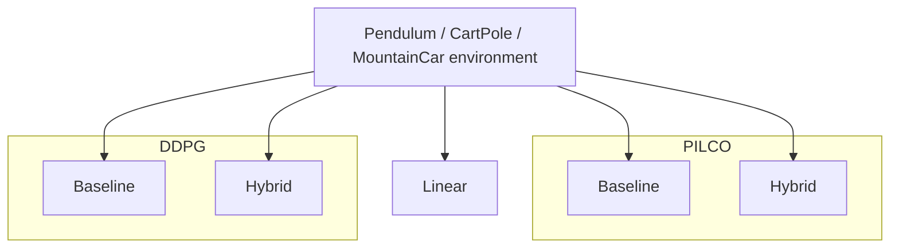
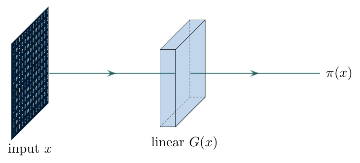
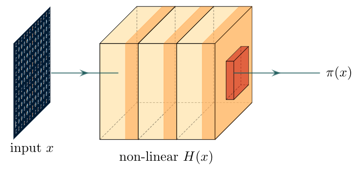
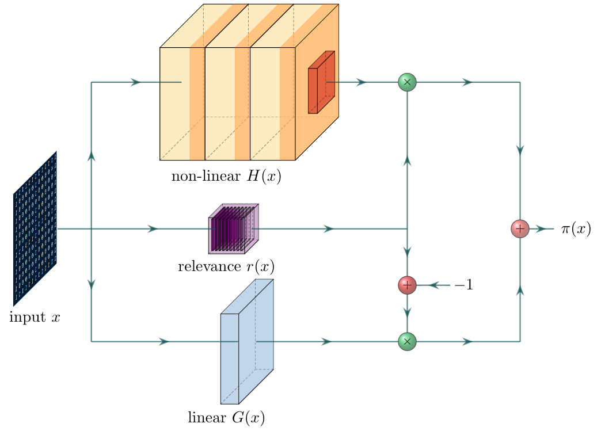

# Locally Enforced Optimal Controller (LEOC)

This repo contains an implementation of the paper `LEOC: A Principled Method in Integrating Reinforcement Learning and Classical Control Theory` submitted to the 3rd Annual Learning for Dynamics & Control Conference (L4DC 2021).

The implementation is based off the [PILCO](https://ieeexplore.ieee.org/abstract/document/6654139/) and [DDPG](https://arxiv.org/abs/1509.02971) frameworks and written in `Python 3`.
`TensorFlow v2`, [`Tensorflow Agents`]() and [`GPflow v2`](https://github.com/GPflow/GPflow) packages have also been used for optimisation and learning.

The rest of this document brings the reader through on how to set up the implementation and reproduce some of the results in the paper.

## Installation
1. Install venv
```bash
virtualenv -p python3 venv
source venv/bin/activate
```
2. Install requirements
```bash
pip install -r requirements.txt
python setup.py develop
```
<!-- 3. You might also need to install openai gym
```bash
pip install gym
``` -->

## File directory
Before we move on, we take a tour of the file directory.
The main training loop is called in `run.py`, configured by a config file in `data` and defined in `dao/trainer.py`.
In this loop, objects associated with the policies are imported from `DDPG` and `pilco`.
The main training loop would also save the trained models in `controllers`, and training rewards as byte stream in `pickle`.
Scripts to perform miscellaneous experiments on the trained policies are kept in `plotting`.

```
LEOC
│   README.md
│   LICENSE
│   requirements.txt
│   setup.py
│   run.py
│
└───DDPG  # files for implementing the DDPG network
│   └───...
│   
└───pilco  # files for implementing the PILCO framework
│   └───...
│   
└───dao  # util files for dependency injection
│   │   trainer.py
│   │   ...
│   │
│   └───envs  # environment files
│       │   cartpole_env.py
│       └───...
│       
└───data  # .gin configuration files
│   │   Cartpole_DDPG_Baseline.gin
│   └───...
│   
└───controllers  # saved trained controllers
│   └───...
│   
└───pickle  # saved training rewards
│   └───...
│   
└───plotting  # scripts for plotting graphs in the paper
│   │   plotter.py
│   └───...
│
└───resources  # resources for README.md
│   └───...
│
└───...
```

## Example of usage
Once the dependecies have been installed, one can run the code to train the policies and reproduce the results in the paper.

#### Training of policies
The experimental sections 5 & 6 of the paper require the trained baseline PILCO and DDPG controllers as well as their hybrid counterparts for subsequent analysis.

Since there are three environments, each of which sees a baseline and a hybrid policy in the PILCO and DDPG frameworks, in addition to a linear controller, there are therefore altogether `3 x (2 x 2 + 1) = 15` policies. Each of these policies is configured in a `.gin` file.



Briefly, the **linear** controller is an engineered controller designed around the operating point. It can be viewed as a non-updating network with only one layer.



The PILCO and DDPG **baseline** policies are learnt, multi-layer networks.



Finally, our LEOC **hybrid** policies integrate the linear and non-linear controllers.



For more technical details, please refer to Section 4 of the paper.

Training a policy is easy. Simply run `run.py` in the root directory with the appropriate `.gin` config file. For instance, to obtain a trained DDPG baseline policy for CartPole, one could run
```
python3 run.py -file data/Cartpole_DDPG_Baseline.gin
```
Analogous commands to train other controllers could be run with the respective `.gin` configuration files.

#### Demos
The trained stable policies in each of the experimental environments would behave like the following:
<video controls="controls" src="resources/pendulum.mov" width="400"></video>
<video controls="controls" src="resources/cartpole.mov" width="400"></video>
<video controls="controls" src="resources/mountaincar.mov" width="400"></video>

#### Rewards curve: Figure 6
When the policies are trained, their training rewards have been dumped in the `pickle` folder. To visualise these rewards, run
```
python3 plotting/plot_learning_curve.py
```

#### Transient responses: Figure 7 & Table 1
One could obtain the impulse and step responses of the trained controllers. Note that the current setup requires a controller in each of the environments.
```
python3 plotting/plot_response.py
```
To output the metrics presented in Table 1, run
```
python3 plotting/compute_metrics.py
```

#### Robustness analysis: Figure 8
Finally, with multiple trained policies in each configuration, we could test their robustness.
```
python3 plotting/plot_robustness.py
```

## Credits:

The `pilco` folder of this implementation is forked off an existing [PILCO repo](https://github.com/nrontsis/PILCO). Similarly, the DDPG implementation relies heavily on [Tensorflow Agents](https://www.tensorflow.org/agents). Credits also go out to OpenAI for and its [gym environments](https://github.com/openai/gym/tree/master/gym/envs/classic_control) for making testing possible.
Neural network/architecture plots have been made with the amazing tools built at [PlotNeuralNet](https://github.com/HarisIqbal88/PlotNeuralNet).
